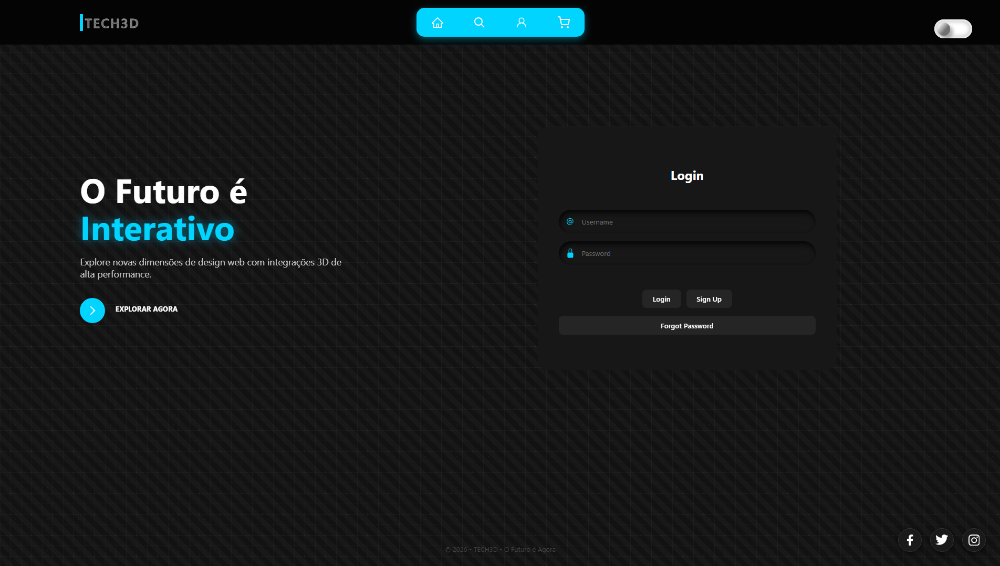

# 🚀 TECH3D - Interface Futurista & Experiência Imersiva

  

## 📌 Sobre o Projeto
O **TECH3D** é um portal conceitual que explora a intersecção entre o design moderno e a alta performance no front-end. O projeto foca no uso de **Glassmorphism** (efeito de vidro fosco), profundidade visual e elementos tridimensionais renderizados puramente com tecnologias web nativas.

Este repositório demonstra minha capacidade de transformar layouts complexos em interfaces responsivas, interativas e visualmente impactantes, utilizando técnicas avançadas de estilização.

---

## ✨ Funcionalidades Principais
* **Moeda 3D Dinâmica:** Um ativo digital (Bitcoin) animado em 3D usando apenas **CSS Transformations** e **SVGs**, sem a necessidade de bibliotecas externas pesadas.
* **Design Glassmorphism:** Uso avançado de `backdrop-filter`, transparências e bordas sutis para criar uma estética premium.
* **Sistema de Temas (Dark/Light):** Alternância de estado visual via Switch, demonstrando manipulação de cores e variáveis CSS.
* **Navegação Futurista:** Menu interativo com ícones minimalistas e botões com efeitos de preenchimento de texto (*hover effects*).
* **Responsividade Total:** Layout adaptável para diferentes tamanhos de tela, garantindo a experiência do usuário em qualquer dispositivo.

---

## 🛠️ Tecnologias Utilizadas
Para este projeto, foquei em utilizar o poder máximo do desenvolvimento nativo para garantir performance e SEO:

* **HTML5 Semântico:** Estrutura clara e acessível.
* **CSS3 Avançado:**
    * Flexbox & CSS Grid para layout.
    * Keyframes para animações fluidas.
    * `perspective` e `transform-style: preserve-3d` para o motor 3D.
* **SVG (Scalable Vector Graphics):** Ícones e elementos gráficos leves que mantêm a nitidez em qualquer resolução.
* **Componentização UI:** Integração e customização de elementos complexos inspirados no ecossistema de design aberto.

---
